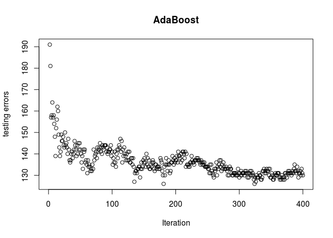

In this file I am trying to show how to write a code for AdaBoost algorithm which is a type of decision tree algorithms. This file is part of my project for Advanced Data Science course with Prof. Culp.

``` r
#create data
library(rpart)
dataFactory<-function(nVar,nObs){
  
  x=matrix(nrow = nObs,ncol = nVar+1)
  colnames(x) <- c(paste("X", 1:nVar, sep = ""),"y")
  
  for(i in 1:nVar){
    x[,i]=rnorm(nObs)
  }
  
  for(j in 1:nObs){
    if(sum((x[j,-(nVar+1)])^2)>9.34){
      x[j,(nVar+1)]=1
    }
    else{
      x[j,(nVar+1)]=-1
    }
  }
  
  x=as.data.frame(x)
  return(x)
}

trainingData=dataFactory(10,200)
testingData=dataFactory(10,500)

#Contorl Parameters
M_boost=400
#tree_control=rpart.control(maxdepth=1,cp=-1,minsplit=0,xval=0)
tree_control=rpart.control(maxdepth=3,cp=-1,minsplit=0,xval=0)
# AdaBoost algorithm
AdaBoost<-function(formulaTree,dataTraining,M){
  
  mf=model.frame(formula = formulaTree,data = dataTraining)
  
  #Create a list for storing the f(x)
  fx=list()
  #Create a vector for storing the beta hat
  betahat=vector(mode = "numeric",length = M)
  #re-sets the formula environment
  environment(formulaTree)<-environment()
  
  #initialize obs weights
  w=rep(1/dim(mf)[1],dim(mf)[1])
    
  for(m in 1:M){
    
    # Fit a weighted tree with w
    hx=rpart(formulaTree,data=mf,method="class",weights = w,control = tree_control)
    
    # Calculate err_m
    predict_y=predict(hx,mf[,-1],type="class")
    err_m=(w%*%as.numeric(mf[,1]!=predict_y))/sum(w)
    
    #Compute beta
    betahat[m]=log((1-err_m)/err_m)
    
    #set new wi
    w=w*exp(betahat[m]*as.numeric(mf[,1]!=predict_y))
  
    #store the tree
    fx[[m]]<-hx
    
  }
  
  lsb=list(betahat,fx)
  return(lsb)
}

# Prediction function of AdaBosting
predictAdaBoost<-function(x0,AdaBfunction){
  
  beta=as.vector(AdaBfunction[[1]])
  
  for(i in 1:length(beta)){
    if(i==1){
      x=predict(AdaBfunction[[2]][[i]],x0,type="class")
    }
    else{
      x=rbind(x,predict(AdaBfunction[[2]][[i]],x0,type="class"))
    }
  }
  x=sign(x-1.5)
  
  y0=beta%*%x

  return(sign(y0))
}

#calculate errors and errors ratio
vtrainingerrors=vector(mode = "numeric",length = M_boost)
vtestingerrors=vector(mode = "numeric",length = M_boost)
vratio=vector(mode = "numeric",length = M_boost)

for(i in 1:M_boost){
  #fit trees
  fst=AdaBoost(y~.,trainingData,i)
  
  #training set errors number
  ytrainingpredict=predictAdaBoost(trainingData[,-dim(trainingData)[2]],fst)
  errostraining=sum(trainingData$y!=ytrainingpredict)
  vtrainingerrors[i]=errostraining
  
  
  #testing set errors number
  ytestingpredict=predictAdaBoost(testingData[,-dim(testingData)[2]],fst)
  errostesting=sum(testingData$y!=ytestingpredict)
  vtestingerrors[i]=errostesting
  
  #ratio
  ratio=errostesting/errostraining
  vratio[i]=ratio
}
```

    ## Warning in Ops.factor(x, 1.5): '-' not meaningful for factors

    ## Warning in Ops.factor(x, 1.5): '-' not meaningful for factors

``` r
#plot
plot(1:M_boost,vtrainingerrors,xlab="Iteration",ylab="training errors",main="AdaBoost")
```


``` r
plot(1:M_boost,vtestingerrors,xlab="Iteration",ylab="testing errors",main="AdaBoost")
```



``` r
plot(1:M_boost,vratio,xlab="Iteration",ylab="testing errors / training errors",main="AdaBoost")
```


